# Centralized Competitive Examination Management Portal
## Complete System Documentation

This document provides a comprehensive overview of the panels, portals, tabs, and technical mechanics of the **Centralized Competitive Examination Management Portal**. It includes screenshot embeds from the actual running system, structural layouts, and deep-dive technical explanations of every page.

---

## 1. Unified Login Screen (`/login`)

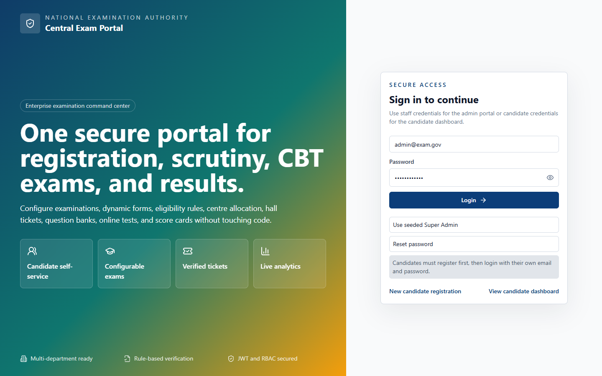

### UI Layout and User Experience
The Login Screen is designed using a modern, split-column aesthetic. The left column features a highly immersive background utilizing a multi-color gradient (deep blue, teal, and amber) representing the National Examination Authority's brand. It showcases the key capabilities of the application—candidate self-service, configurable exams, verified tickets, and live analytics—via card components with frosted glass effects. The right column is a clean, minimal white panel containing the login card. It provides clear input fields for Email and Password, error/success banners, and quick-access utility buttons:
- **"Use seeded Super Admin"**: Automatically populates the credentials of the system administrator.
- **"Reset password"**: Toggles the card into a password reset simulation mode, where users can update passwords directly in the database.
- **Navigation Links**: Links to register new candidates or jump directly to the candidate dashboard.

### Business Logic and Functional Workflow
The login page acts as the system's gateway, managing access for all roles including Candidates, Super Admins, Examination Controllers, Document Verifiers, Question Paper Setters, Result Officers, and Read-Only Auditors. Upon entering credentials, the system initiates a login process through the authentication service. If a candidate enters their credentials, they are redirected to `/candidate`. If a staff member or administrator logs in, they are redirected to their target dashboard panel. The "Reset Password" button allows the user to update the database password hash directly, simulating a password recovery workflow.

### Technical Implementation
- **Frontend Route**: `/login` (rendered by the `Login` component in [Login.tsx](file:///c:/Users/Administrator/Documents/Codex/2026-07-09/files-mentioned-by-the-user-project/outputs/centralized-exam-portal/frontend/src/pages/Login.tsx)).
- **State Management**: Uses local state variables (`email`, `password`, `confirmPassword`, `error`, `notice`, `loading`, `showPassword`, `resetMode`) to handle form data and validation.
- **Backend API**: Calls `/api/auth/login` (or `/api/auth/reset-password` during reset).
- **Prisma Models**: Modifies the `User` table to match email, fetch the `Role` entity, and check/update the `passwordHash` using bcrypt comparison.
- **Security Protocols**: Implements JSON Web Tokens (JWT) for session management, storing an `accessToken` and `refreshToken` in local storage. Rate limiting is active on this endpoint.

---

## 2. Admin Portal - Main Dashboard (`/admin`)

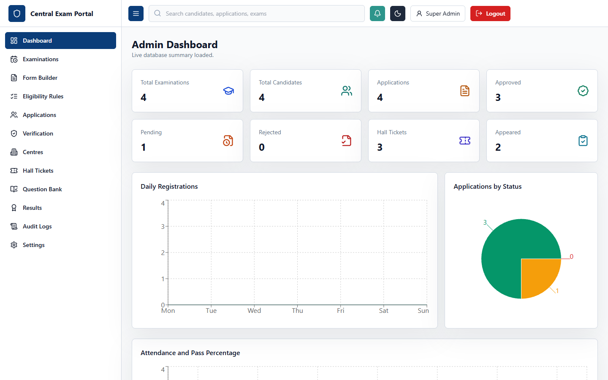

### UI Layout and User Experience
The Admin Dashboard is the centralized command center for system administrators and staff. The page layout consists of a collapsible left navigation sidebar, a top navbar showing the portal title and active user info, and a main dashboard panel. The panel displays:
- **Summary Cards**: Eight key metric indicators showing the count of Examinations, Candidates, Applications, Approved Applications, Pending Applications, Rejected Applications, Hall Tickets, and Results. Each card features distinct icons and background colors corresponding to their status.
- **Daily Registrations Chart**: An Area Chart showcasing daily registration and approval trends over a timeline, using Recharts.
- **Applications by Status Chart**: A colorful Pie Chart displaying the percentage distribution of approved, pending, and rejected applications.
- **Attendance and Pass Percentage Chart**: A Bar Chart comparing registrations to approvals, indicating system efficiency and exam outcomes.

### Business Logic and Functional Workflow
The Main Dashboard provides administrators with real-time operational insights. When the dashboard loads, it requests a consolidated summary from the database. If the database connection fails or the tables are empty, it gracefully reports the error state in the sub-header while falling back to cached analytics mockups to ensure a smooth user experience. Admins use these charts to monitor the load on the system, assess document verification progress, and track overall application volumes during the registration phase.

### Technical Implementation
- **Frontend Route**: `/admin` (rendered by the `AdminDashboard` component in [AdminDashboard.tsx](file:///c:/Users/Administrator/Documents/Codex/2026-07-09/files-mentioned-by-the-user-project/outputs/centralized-exam-portal/frontend/src/pages/AdminDashboard.tsx)).
- **State Management**: Uses `summary` state (typed as `DashboardSummary`) and `notice` state to log API sync status.
- **Backend API**: Requests data from `/api/dashboard/summary`.
- **Prisma Models**: Computes counts across multiple models: `User`, `Candidate`, `Application`, `HallTicket`, and `Result`.
- **Security Protocols**: The route is wrapped by `ProtectedRoute` which verifies the user's role (Super Admin, Controller, Auditor, etc.) via the auth context.

---

## 3. Admin Portal - Examinations Management (`/admin/examinations`)

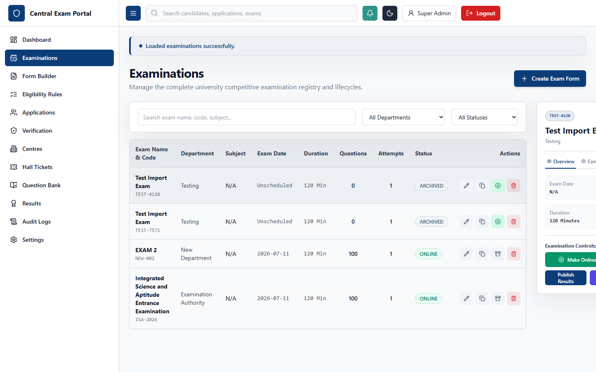

### UI Layout and User Experience
The Examinations panel features a split-pane layout designed for managing exam configurations. The left side contains a search input, filters for department and status, and a detailed data table listing examinations with columns for Code, Name, Department, Subject, Date, Duration, Total Questions, Attempts, Status, and action buttons. Selecting an examination opens a detail panel on the right side. This detail panel features 5 interactive tabs:
- **Overview Tab**: Details the date, duration, instructions, and contains controls to manage the exam lifecycle (Make Online, Reopen, Archive, Publish Results).
- **Config Tab**: Details configuration options such as subject, passing marks, negative marking, attempt limits, and randomization.
- **Attempts Tab**: Lists audit logs of candidate exam attempts.
- **Stats Tab**: Displays performance analytics (total attempts, average score, pass rate).
- **Workflow Tab**: Connects to the phase scheduling engine.

### Business Logic and Functional Workflow
Admins use this screen to configure, schedule, and transition examinations through their operational lifecycles: `DRAFT`, `PUBLISHED`, `ONLINE`, `COMPLETED`, `RESULTS_PUBLISHED`, and `ARCHIVED`. For example, clicking "Make Online" moves an exam from Draft to Online, making it instantly visible to candidates. Clicking "Publish Results" initiates automatic answer sheet evaluation, generating scorecards and rankings. The search and filter tools allow managers to coordinate hundreds of exams concurrently.

### Technical Implementation
- **Frontend Route**: `/admin/examinations` (rendered by the `Examinations` component in [Examinations.tsx](file:///c:/Users/Administrator/Documents/Codex/2026-07-09/files-mentioned-by-the-user-project/outputs/centralized-exam-portal/frontend/src/pages/Examinations.tsx)).
- **State Management**: Uses `rows`, `selectedExamId` (synced to local storage via `usePersistentState`), `activeTab` (defaulting to "overview"), `attempts`, and form inputs.
- **Backend API**: Connects to `/api/examinations` (GET, POST, PATCH, DELETE) and sub-endpoints `/api/results/attempts` and `/api/results/publish`.
- **Prisma Models**: Heavily manipulates the `Examination`, `WorkflowPhase`, `ExamAttempt`, and `Result` models.
- **Audit Logging**: Every transition (e.g., archiving an exam) writes an entry to the `AuditLog` table.

---

## 4. Admin Portal - Dynamic Form Builder (`/admin/form-builder`)

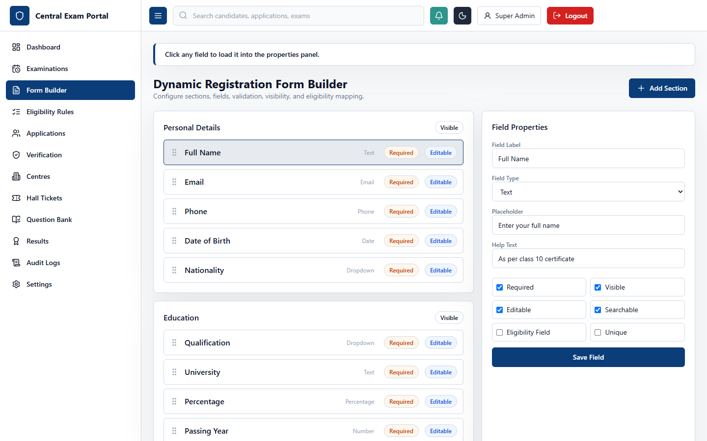

### UI Layout and User Experience
The Dynamic Form Builder allows administrators to configure custom registration forms for each examination without writing code. The interface is divided into a layout control section on the left and a field properties editor on the right:
- **Left Panel**: Displays sections (e.g., Personal Details, Academic Background) and fields within those sections in a list. Users can add new sections or fields and change their display order.
- **Right Panel**: Editing card that loads whenever a field is selected. It features settings for Label, Field Type (Text, Number, Date, Select, Checkbox, File), Validation Rules (Required, Minimum/Maximum length, Regex), and custom flags (Searchable, Eligibility field, Unique).

### Business Logic and Functional Workflow
Since different competitive exams have unique application requirements (e.g., engineering exams require technical qualifications, civil service exams require age limits, and medical tests require residency proofs), the form builder dynamically generates the application wizard presented to candidates. Admins define sections and fields, link them to validation constraints, and flag fields that are critical for automated eligibility processing. Saving a template updates the form blueprint in the database, which is immediately loaded by the registration wizard.

### Technical Implementation
- **Frontend Route**: `/admin/form-builder` (rendered by the `FormBuilder` component in [FormBuilder.tsx](file:///c:/Users/Administrator/Documents/Codex/2026-07-09/files-mentioned-by-the-user-project/outputs/centralized-exam-portal/frontend/src/pages/FormBuilder.tsx)).
- **State Management**: Uses `sections` list, `selectedFieldId`, and active input values to enable real-time field configuration previews.
- **Backend API**: Communicates with `/api/examinations/:id/form-template` to fetch, save, or update dynamic structures.
- **Prisma Models**: Maps structures directly to `DynamicFormTemplate`, `DynamicFormSection`, and `DynamicFormField` models.
- **Validation**: Dynamic fields serialize validation rules as a JSON object in the `validationRules` column, which is evaluated on the client and server during application submission.

---

## 5. Admin Portal - Eligibility Rules Builder (`/admin/rules`)

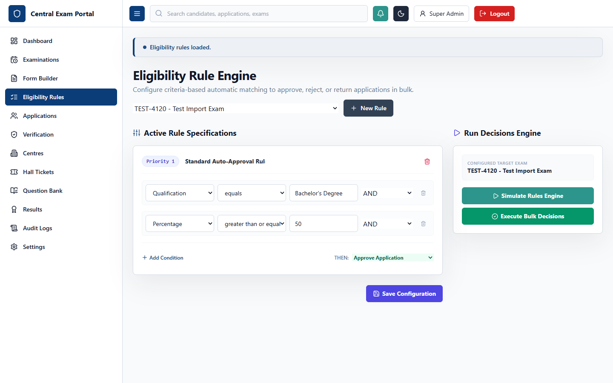

### UI Layout and User Experience
The Eligibility Rules Builder is a visual interface that allows admins to build criteria filter rules for examinations. The interface consists of two key columns:
- **Left Pane**: Lists configured rules for the selected exam, showcasing the Rule Name, Priority, Status (Active/Inactive), Action (Approve Automatically, Reject, Hold, Manual Scrutiny), and an action bar to duplicate or delete rules.
- **Right Pane**: The rule conditions workstation. It displays a tree-like structure of clauses joined by logical connectors (AND, OR, NOT). Each clause contains a field selector (loaded dynamically from the form builder), comparison operator (Equals, Greater Than, Less Than, Contains), and constant value.

### Business Logic and Functional Workflow
The rule engine automates the candidate screening process. Instead of manually reviewing thousands of academic percentages, age constraints, or categories, the eligibility engine evaluates candidates against these rule sets. For example, a rule might state: "IF Qualification Equals 'B.Tech' AND Percentage Greater Than Or Equal To '60' AND Category Equals 'General' THEN Action = Approve Automatically". Admins can prioritize rules, simulate their behavior on mock candidate data, and run them in bulk.

### Technical Implementation
- **Frontend Route**: `/admin/rules` (rendered by the `EligibilityRules` component in [EligibilityRules.tsx](file:///c:/Users/Administrator/Documents/Codex/2026-07-09/files-mentioned-by-the-user-project/outputs/centralized-exam-portal/frontend/src/pages/EligibilityRules.tsx)).
- **State Management**: Tracks rule arrays, details of the active rule being edited, and logical condition structures.
- **Backend API**: Connects to `/api/eligibility-rules` (GET, POST, PATCH, DELETE).
- **Prisma Models**: Direct reads and writes to `EligibilityRule` and `EligibilityCondition` tables.
- **Evaluation Engine**: The backend implements an evaluator that converts these tree structures into SQL filters or dynamically executes JS conditions on the candidate's dynamic form responses.

---

## 6. Admin Portal - Application Management (`/admin/applications`)

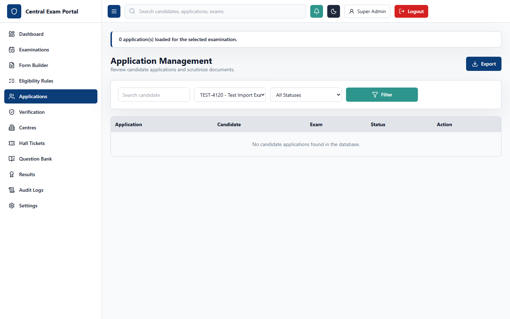

### UI Layout and User Experience
The Application Scrutiny workstation displays candidate submissions. The layout consists of:
- **Left Column**: A searchable table of candidates who have applied for the selected examination. Columns display Application Number, Candidate Name, Submission Date, Eligibility Status, and overall Verification Status.
- **Right Column**: A details dashboard that loads when an application row is clicked. It presents candidate personal details, dynamic form responses, an interactive application timeline (Applied, Under Scrutiny, Approved, Rejected), and a quick-action panel to verify uploaded documents, approve, reject, hold, or return the application for correction.

### Business Logic and Functional Workflow
This page is used by examination officers to manage candidate applications. When candidate applications are submitted, they enter a `PENDING` state. If automated rules are run, they might transition to `APPROVED` or `MANUAL_SCRUTINY`. Officers can review candidate details, add audit remarks, and update statuses. If an application contains mistakes (e.g., incorrect marks entered), the officer can mark it as `RETURNED_FOR_CORRECTION`, which unlocks the forms for the candidate to edit.

### Technical Implementation
- **Frontend Route**: `/admin/applications` (rendered by the `Applications` component in [Applications.tsx](file:///c:/Users/Administrator/Documents/Codex/2026-07-09/files-mentioned-by-the-user-project/outputs/centralized-exam-portal/frontend/src/pages/Applications.tsx)).
- **State Management**: Uses state variables to track list rows, filters, selected application details, status transitions, and remarks text.
- **Backend API**: Interfaces with `/api/applications` to retrieve applications, change status, and write timeline history.
- **Prisma Models**: Modifies `Application` and appends records to `ApplicationHistory` to maintain a log of status changes.

---

## 7. Admin Portal - Document Verification (`/admin/verification`)

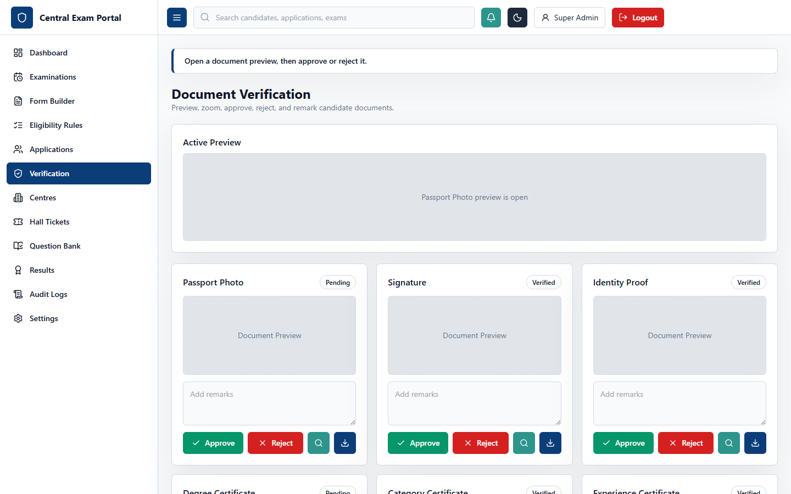

### UI Layout and User Experience
The Document Verification interface provides a workspace for verification officers. The screen is designed for efficient reviewing:
- **Left Panel**: Lists candidates requiring document verification, showing name, application code, and count of uploaded files.
- **Right Panel**: A viewer displaying the selected candidate's document list (e.g., Passport Photo, Signature, Degree Certificate, Category Certificate). Clicking a document opens a viewer that supports zooming, rotation, and downloading. Below the viewer is a status controller (Approve, Reject) and a remarks text area.

### Business Logic and Functional Workflow
Document Verifiers use this screen to scrutinize uploaded files against system requirements. A verifier reviews the candidate's photograph and signature for clarity, and confirms that academic certificates match the information entered in the registration form. If a document is correct, the verifier clicks "Approve". If it is invalid (e.g., an expired certificate or blurred signature), they click "Reject" and enter a reason (e.g., "Certificate expired in 2025, upload latest copy").

### Technical Implementation
- **Frontend Route**: `/admin/verification` (rendered by the `Verification` component in [Verification.tsx](file:///c:/Users/Administrator/Documents/Codex/2026-07-09/files-mentioned-by-the-user-project/outputs/centralized-exam-portal/frontend/src/pages/Verification.tsx)).
- **State Management**: Coordinates the lists of candidates, active document indexes, zoom levels, loading overlays, and review comments.
- **Backend API**: Connects to `/api/applications/:id/documents` and `/api/applications/:id/documents/:docId/verify` (POST/PATCH).
- **Prisma Models**: Reads and updates the `ApplicationDocument` model.
- **File Delivery**: Delivers documents via signed URLs linked to Cloudinary, ensuring secure access to candidate credentials.

---

## 8. Admin Portal - Centre Management (`/admin/centres`)

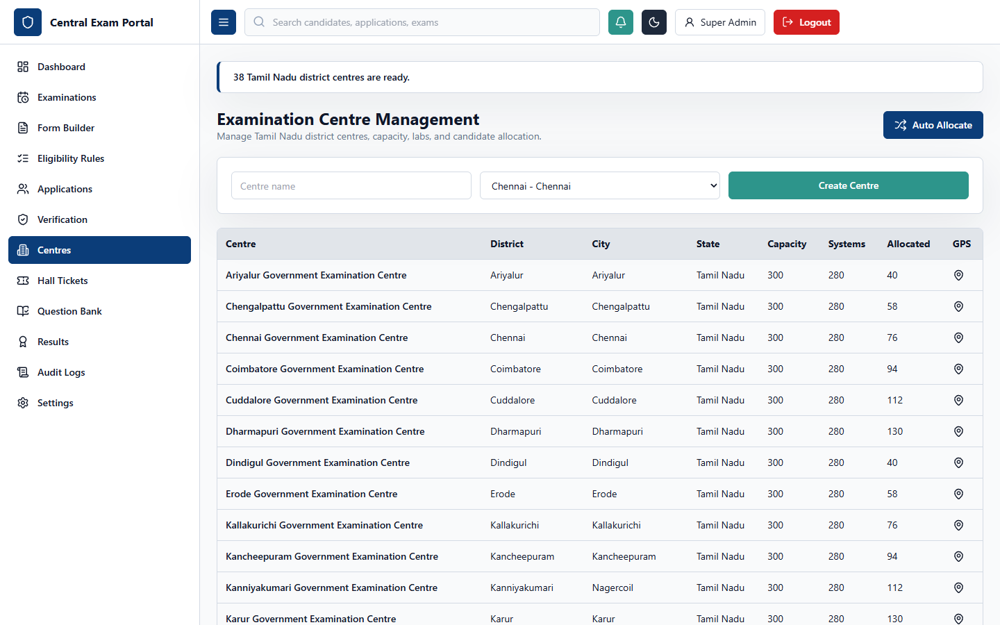

### UI Layout and User Experience
The Centre Management dashboard handles physical examination venues. The layout consists of:
- **Main List Pane**: A grid listing all registered exam centres, displaying details such as Centre Code, Venue Name, City, State, Capacity, Available Systems, GPS Coordinates, and current candidate allocation load.
- **Details Panel**: Shows the geographical location of the centre (using lat/long coordinates), a list of allocated candidates, lab-wise computer breakdowns, and controls to add new venues or trigger bulk candidate allocation algorithms.

### Business Logic and Functional Workflow
Examination Controllers use this page to set up physical test centres, define capacity constraints, and allocate candidates. Once applications are approved, candidates must be assigned to centres based on their location preferences and centre availability. The controller can run a bulk auto-allocation algorithm that assigns seat numbers, labs, and dates, preventing overbooking.

### Technical Implementation
- **Frontend Route**: `/admin/centres` (rendered by the `Centres` component in [Centres.tsx](file:///c:/Users/Administrator/Documents/Codex/2026-07-09/files-mentioned-by-the-user-project/outputs/centralized-exam-portal/frontend/src/pages/Centres.tsx)).
- **State Management**: Manages lists of centres, forms for creating new venues, and parameters for candidate allocation.
- **Backend API**: Accesses `/api/examinations/:id/centres` (GET, POST, PATCH, DELETE) and `/api/examinations/:id/centres/allocate` (POST).
- **Prisma Models**: Directly query and modify the `ExamCentre` table and associate allocations with `HallTicket` records.

---

## 9. Admin Portal - Hall Ticket Management (`/admin/hall-tickets`)

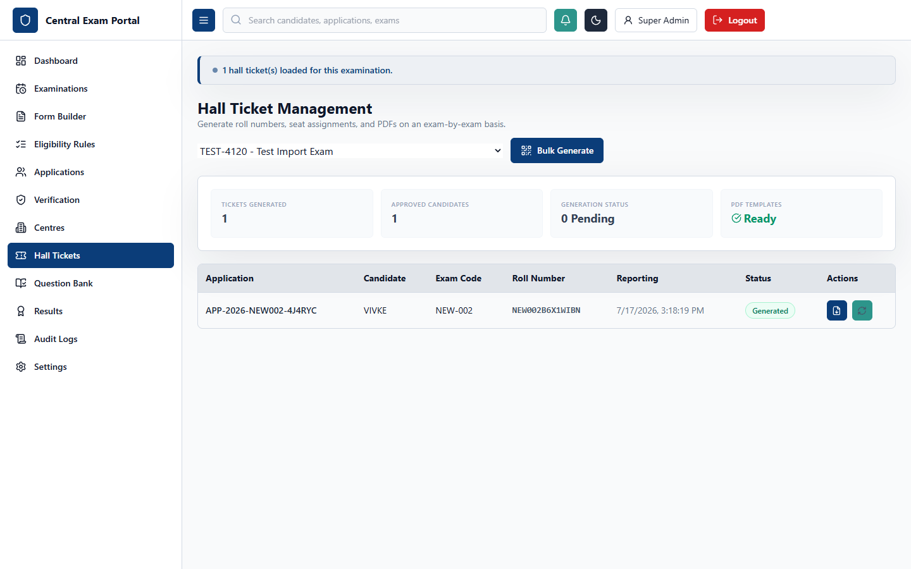

### UI Layout and User Experience
The Hall Ticket Management interface controls exam admit cards. It features:
- **Filters Row**: Search by application number, roll number, or candidate name, along with an exam selector.
- **Main Table**: Lists eligible candidates, displaying Application Number, Candidate Name, Roll Number, Assigned Centre, Seat Number, Reporting Time, and Hall Ticket Status.
- **Control Bar**: Features buttons to generate roll numbers, assign seat numbers, release hall tickets to candidate dashboards, and download PDFs in bulk.

### Business Logic and Functional Workflow
After applications are approved and centres are allocated, the system generates hall tickets. Clicking "Generate Tickets" creates unique roll numbers, assigns seats, and generates QR/barcodes. Clicking "Release tickets" updates the active workflow phase, allowing candidates to view and download their hall tickets from their dashboards.

### Technical Implementation
- **Frontend Route**: `/admin/hall-tickets` (rendered by the `HallTickets` component in [HallTickets.tsx](file:///c:/Users/Administrator/Documents/Codex/2026-07-09/files-mentioned-by-the-user-project/outputs/centralized-exam-portal/frontend/src/pages/HallTickets.tsx)).
- **State Management**: Tracks selected exam IDs, table records, loading states, and bulk generation parameters.
- **Backend API**: Calls `/api/hall-tickets` and `/api/hall-tickets/generate` (POST).
- **Prisma Models**: Updates the `HallTicket` table, linking it to the `Application` and `ExamCentre` tables.
- **PDF Generation**: The backend uses `pdfkit` to generate printable hall tickets containing candidate photos, barcodes, and centre details.

---

## 10. Admin Portal - Question Bank (`/admin/questions`)

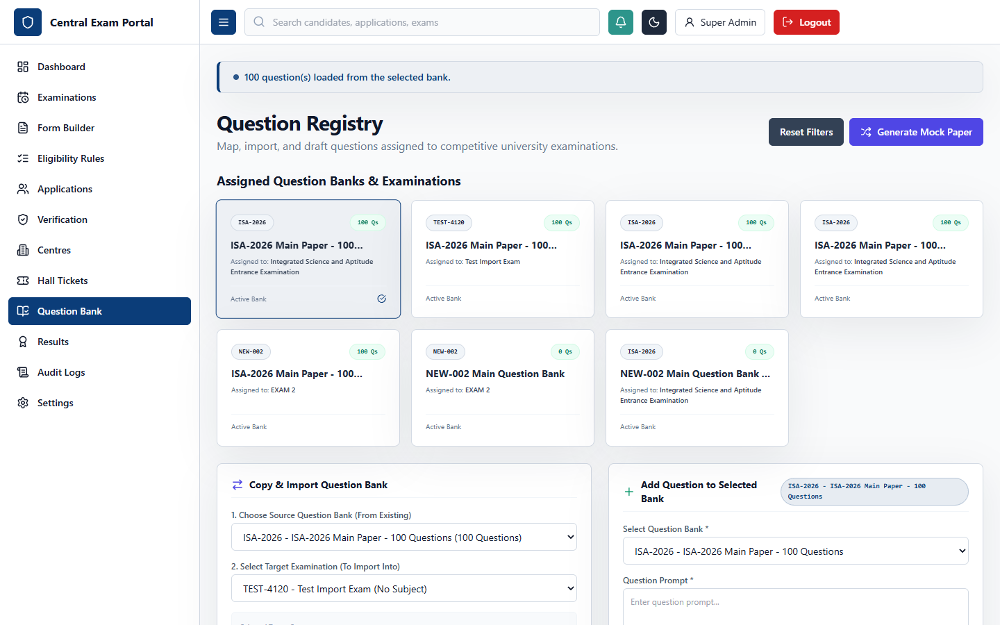

### UI Layout and User Experience
The Question Bank panel provides a workspace for question paper setters. The page uses a split-layout design:
- **Left Column**: A tree-view showing Subjects and Topics, allowing setters to filter questions by category.
- **Main Pane**: Lists questions, showing the question prompt, difficulty (Easy, Medium, Hard), type (MCQ, MSQ, Numeric), marks, and action buttons. Selecting a question opens the editor panel.
- **Editor Panel**: Features text areas for the question prompt and option text, checkboxes to mark correct options, and a text field for explanation text.

### Business Logic and Functional Workflow
Setters use this screen to build and manage question banks. They can categorize questions by subject, set difficulty levels, and configure marks and negative marking rules. Once a question set is complete, it is linked to an examination. The online exam engine uses these question banks to render tests, randomizing questions and options if enabled.

### Technical Implementation
- **Frontend Route**: `/admin/questions` (rendered by the `QuestionBank` component in [QuestionBank.tsx](file:///c:/Users/Administrator/Documents/Codex/2026-07-09/files-mentioned-by-the-user-project/outputs/centralized-exam-portal/frontend/src/pages/QuestionBank.tsx)).
- **State Management**: Manages subjects/topics, lists of questions, and editor form data.
- **Backend API**: Connects to `/api/questions` (GET, POST, PATCH, DELETE) and `/api/questions/banks` (GET).
- **Prisma Models**: Interacts with the `Subject`, `Topic`, `QuestionBank`, `Question`, and `QuestionOption` models.

---

## 11. Admin Portal - Result Management (`/admin/results`)

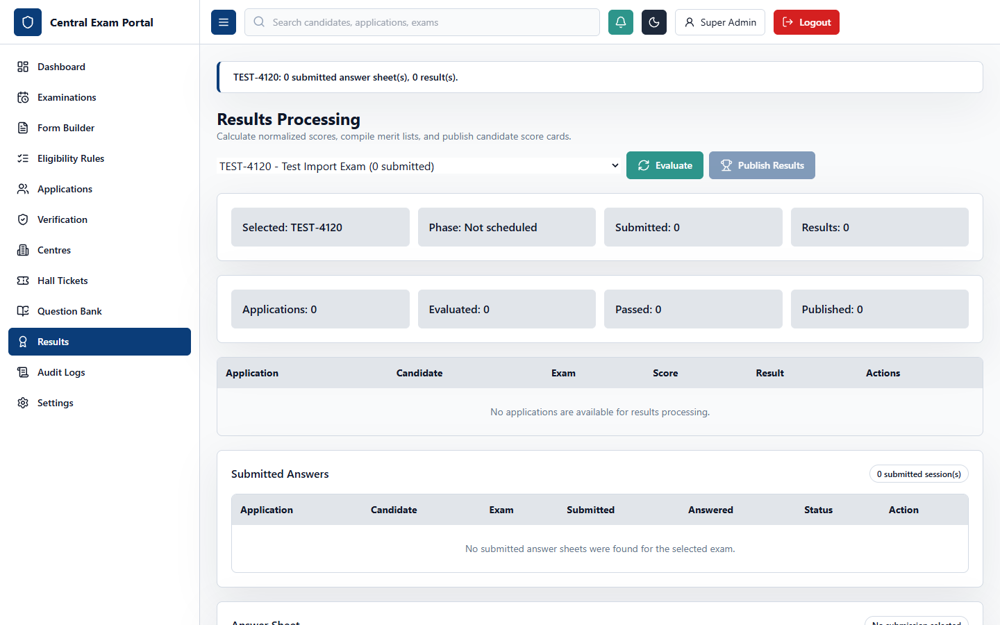

### UI Layout and User Experience
The Result Management panel handles grading and rankings. It features:
- **Statistics Row**: Displays key performance indicators, including average score, pass rate, and highest marks.
- **Results Table**: Lists candidates, showing roll number, marks obtained, percentage, rank, and status (Qualified/Not Qualified).
- **Action Bar**: Contains buttons to recalculate results, hold specific candidate results, publish results, and export merit lists.

### Business Logic and Functional Workflow
After examinations are completed, the result engine calculates marks based on candidate responses and the correct options in the question bank. It computes percentages, ranks candidates, and determines eligibility based on passing marks. Once the result officer approves the results, they are published, allowing candidates to view their scores.

### Technical Implementation
- **Frontend Route**: `/admin/results` (rendered by the `Results` component in [Results.tsx](file:///c:/Users/Administrator/Documents/Codex/2026-07-09/files-mentioned-by-the-user-project/outputs/centralized-exam-portal/frontend/src/pages/Results.tsx)).
- **State Management**: Tracks results tables, selected exam statistics, and publishing states.
- **Backend API**: Calls `/api/results` (GET), `/api/results/publish` (POST), and `/api/results/recalculate` (POST).
- **Prisma Models**: Computes and stores entries in the `Result` model, linked to `Application` and `Examination` tables.

---

## 12. Admin Portal - Audit Logs (`/admin/audit`)

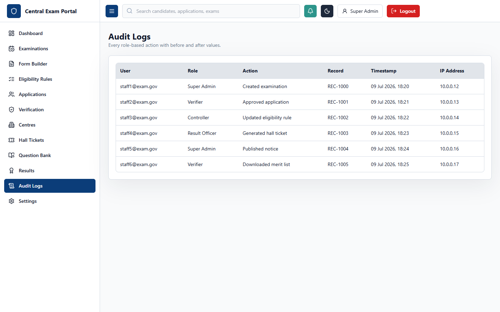

### UI Layout and User Experience
The Audit Logs panel is a read-only table designed for auditors. It features:
- **Filters Row**: Search by user email, role, or action, with a date range filter.
- **Data Table**: Lists system events, displaying timestamp, user email, user role, action, affected record, and IP address.
- **Details Panel**: Shows the old and new values of modified records to track changes.

### Business Logic and Functional Workflow
The audit log system records all critical actions in the portal to ensure compliance and security. It tracks events such as configuration changes, result publications, and document verifications, providing a complete history of system activity.

### Technical Implementation
- **Frontend Route**: `/admin/audit` (rendered by the `AuditLogs` component in [AuditLogs.tsx](file:///c:/Users/Administrator/Documents/Codex/2026-07-09/files-mentioned-by-the-user-project/outputs/centralized-exam-portal/frontend/src/pages/AuditLogs.tsx)).
- **State Management**: Tracks audit logs tables, filters, and selected log details.
- **Backend API**: Connects to `/api/audit-logs` (GET).
- **Prisma Models**: Reads from the `AuditLog` table.
- **Middleware**: Backend routes use an audit logging middleware to write events to the database on successful write operations.

---

## 13. Admin Portal - System Settings (`/admin/settings`)

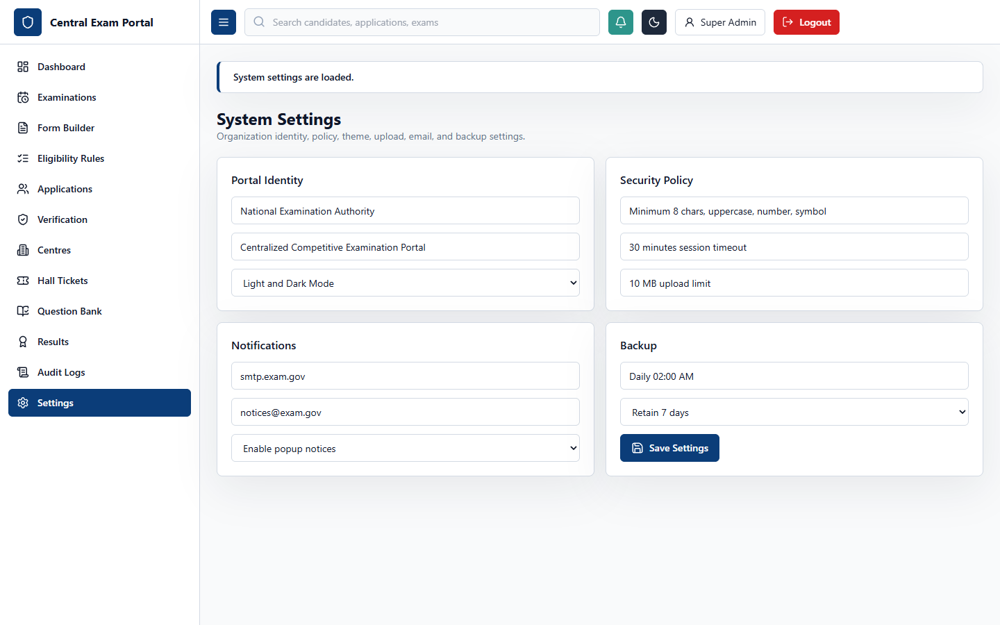

### UI Layout and User Experience
The System Settings panel manages application-wide configurations. The interface features a sidebar to toggle between settings sections:
- **General**: Configure portal name, logo, and active UI theme.
- **Security**: Manage password strength requirements, session timeouts, and MFA.
- **Storage**: Set limits for file sizes and allowed file types.
- **Integrations**: Configure SMTP settings for emails.
- **Backup**: Manage database backup schedules.

### Business Logic and Functional Workflow
Admins use this screen to manage system behavior. Changes to settings (e.g., updating file upload limits) are saved to the database and applied globally, ensuring consistent behavior across the application.

### Technical Implementation
- **Frontend Route**: `/admin/settings` (rendered by the `Settings` component in [Settings.tsx](file:///c:/Users/Administrator/Documents/Codex/2026-07-09/files-mentioned-by-the-user-project/outputs/centralized-exam-portal/frontend/src/pages/Settings.tsx)).
- **State Management**: Tracks setting categories, form data, and saving states.
- **Backend API**: Communicates with `/api/settings` (GET, PATCH).
- **Prisma Models**: Reads and updates configurations in the `SystemSetting` table.

---

## 14. Candidate Portal - Multi-Step Registration (`/register`)

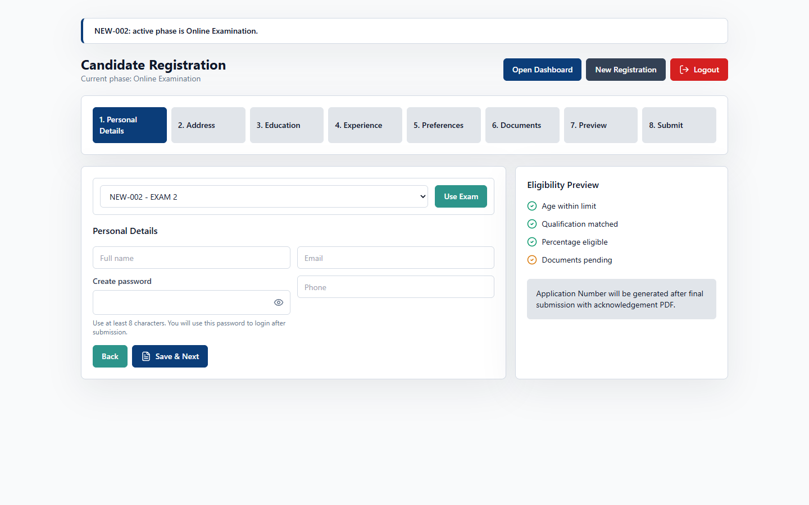

### UI Layout and User Experience
The Candidate Registration Portal features a multi-step registration wizard. The layout includes:
- **Progress Tracker**: Displays the current step (Personal details, Address, Education, Preferences, Upload Documents, Preview, and Submit).
- **Form Pane**: Shows the dynamic form configured by the administrator for the selected examination.
- **Navigation Bar**: Features buttons to save progress, go back, or proceed to the next step.

### Business Logic and Functional Workflow
Candidates use this wizard to apply for examinations. The system loads the exam's custom form template and guides the candidate through the registration steps. It validates inputs (e.g., age limits) and handles file uploads. Once submitted, the application is locked, and a unique application number is generated.

### Technical Implementation
- **Frontend Route**: `/register` (rendered by the `CandidatePortal` component in [CandidatePortal.tsx](file:///c:/Users/Administrator/Documents/Codex/2026-07-09/files-mentioned-by-the-user-project/outputs/centralized-exam-portal/frontend/src/pages/CandidatePortal.tsx)).
- **State Management**: Tracks current wizard steps, form data across categories, and validation errors.
- **Backend API**: Sends data to `/api/applications` (POST) and uploads files via `/api/upload`.
- **Prisma Models**: Creates records in `Candidate`, `CandidateProfile`, `Application`, and `DynamicFormResponse` tables.

---

## 15. Candidate Dashboard (`/candidate`)

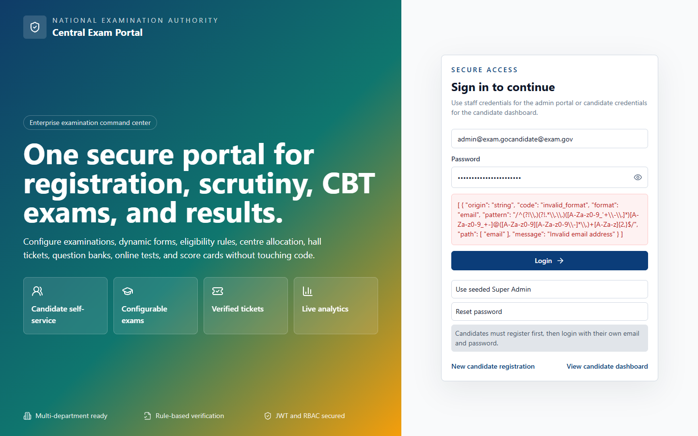

### UI Layout and User Experience
The Candidate Dashboard is the central workspace for candidates. The layout includes:
- **Application Summary**: Shows the candidate's profile, application status, and examination details.
- **Timeline Progress**: A visual timeline showing the status of the application (Submitted -> Scrutiny -> Approved -> Hall Ticket -> Exam -> Result).
- **Action Cards**: Active buttons for tasks corresponding to the current workflow phase (e.g., "Download Hall Ticket", "Start Exam", "View Results").

### Business Logic and Functional Workflow
The candidate dashboard updates dynamically based on the active workflow phase set by the administrator. During the registration phase, the candidate can monitor their application status. When the exam controller releases hall tickets, a download link appears. During the exam phase, the dashboard displays a button to start the test. After results are published, the scorecard becomes available.

### Technical Implementation
- **Frontend Route**: `/candidate` (rendered by the `CandidateDashboard` component in [CandidateDashboard.tsx](file:///c:/Users/Administrator/Documents/Codex/2026-07-09/files-mentioned-by-the-user-project/outputs/centralized-exam-portal/frontend/src/pages/CandidateDashboard.tsx)).
- **State Management**: Tracks application details, notifications, and workflow phases.
- **Backend API**: Calls `/api/applications/my-application` (GET) and retrieves files.
- **Prisma Models**: Queries the `Application`, `WorkflowPhase`, `HallTicket`, and `Result` models.

---

## 16. Candidate Portal - Online Exam CBT (`/exam`)

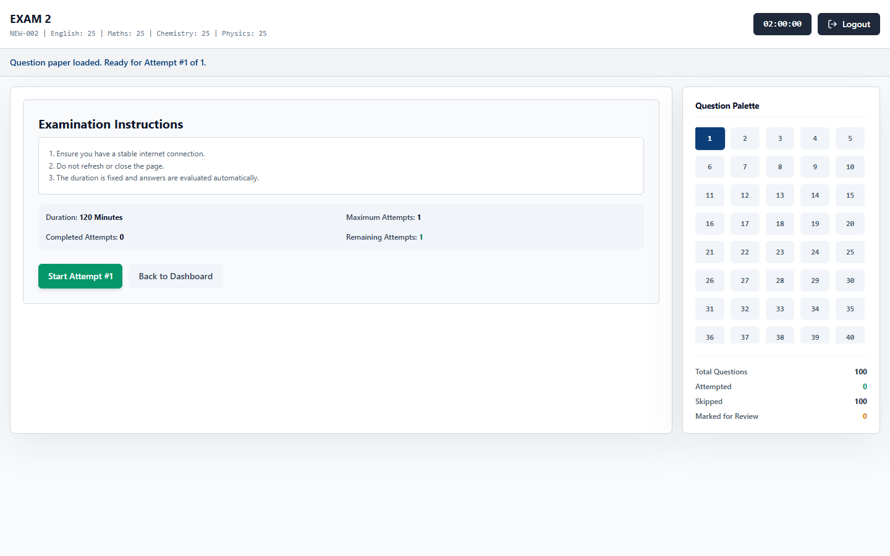

### UI Layout and User Experience
The CBT Online Exam interface provides a secure environment for testing. The layout consists of:
- **Top Header**: Displays the examination title, candidate name, and a countdown timer.
- **Question Pane (Left)**: Shows the current question text, options (radio buttons), and navigation controls (Save & Next, Mark for Review, Clear).
- **Question Palette (Right)**: A grid of question numbers colored by status (Green = Answered, Red = Unanswered, Purple = Marked for Review, Grey = Not Visited).

### Business Logic and Functional Workflow
When the exam starts, the countdown timer begins. Candidates select answers and navigate through questions. The system auto-saves responses to prevent data loss. Once the timer expires or the candidate submits the test, responses are locked and saved for evaluation.

### Technical Implementation
- **Frontend Route**: `/exam` (rendered by the `OnlineExam` component in [OnlineExam.tsx](file:///c:/Users/Administrator/Documents/Codex/2026-07-09/files-mentioned-by-the-user-project/outputs/centralized-exam-portal/frontend/src/pages/OnlineExam.tsx)).
- **State Management**: Tracks current question indexes, answer states, countdown seconds, and synchronization statuses.
- **Backend API**: Connects to `/api/sessions/start` (POST), `/api/sessions/save-response` (PATCH), and `/api/sessions/submit` (POST).
- **Prisma Models**: Creates and updates records in the `ExamSession` and `CandidateResponse` models.
